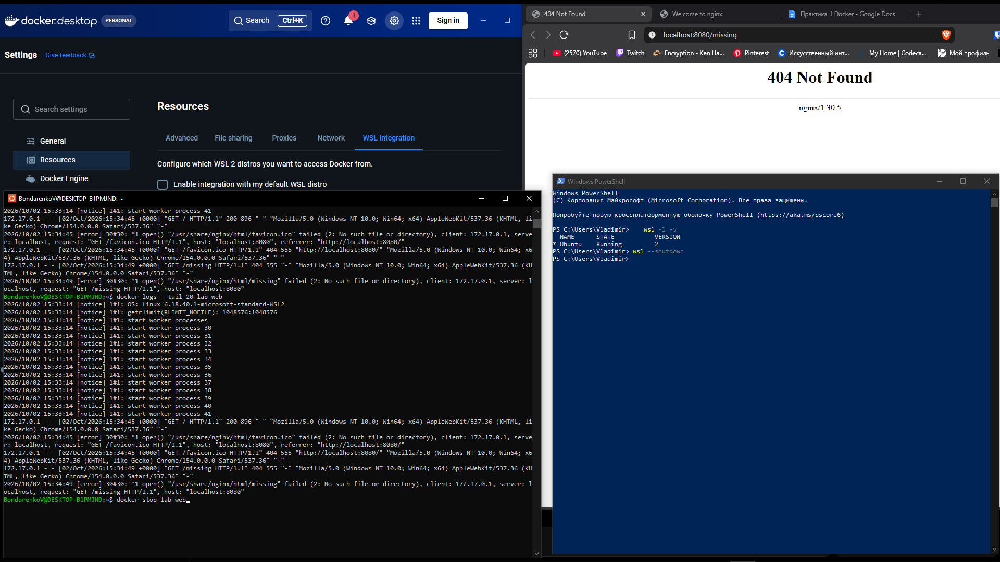
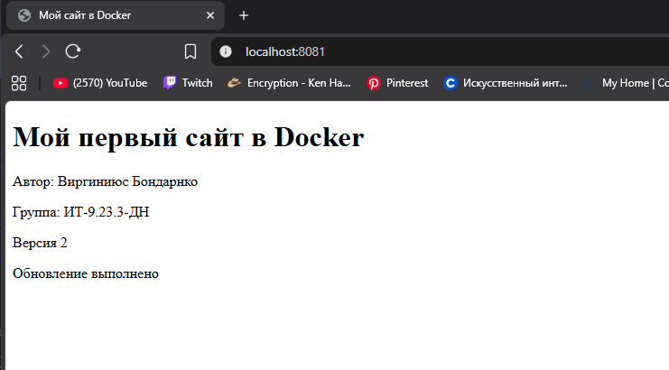
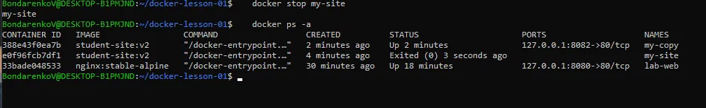
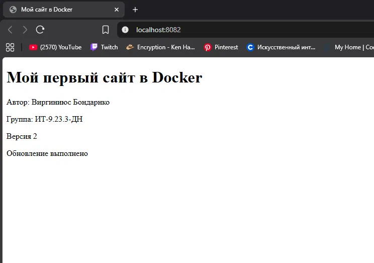

# Практика 1: Docker

**Автор:** Виргиниюс Бондаренко, группа ИТ-9.23.3-ДН

## Задание 1. Проверка Docker
```bash
docker version
docker run --rm hello-world
```
Docker работает: есть разделы Client и Server, получено сообщение `Hello from Docker!`.

## Задание 2. Готовый сайт nginx
```bash
docker run -d --name lab-web -p 127.0.0.1:8080:80 nginx:stable-alpine
docker ps
docker logs --tail 20 lab-web
```
Страница `http://localhost:8080` показывает Welcome to nginx!, а `/missing` отдаёт 404. В логе виден запрос `GET /missing` с кодом 404.



## Задание 3. Остановка и запуск
```bash
docker stop lab-web
docker ps
docker ps -a
docker start lab-web
docker exec lab-web cat /usr/share/nginx/html/index.html
```
После остановки контейнер пропал из `docker ps`, но остался в `docker ps -a` со статусом Exited. После `docker start` имя и ID сохранились.

## Задание 4. Файлы сайта
```bash
mkdir -p ~/docker-lesson-01
cd ~/docker-lesson-01
nano index.html
nano Dockerfile
```
Dockerfile:
```dockerfile
FROM nginx:stable-alpine
COPY index.html /usr/share/nginx/html/index.html
```

## Задание 5. Сборка и запуск v1
```bash
docker build -t student-site:v1 .
docker image ls student-site
docker run -d --name my-site -p 127.0.0.1:8081:80 student-site:v1
```
Сайт на `http://localhost:8081` показывает мои данные и «Версия 1».

## Задание 6. Версия 2
```bash
docker restart my-site
docker build -t student-site:v2 .
docker stop my-site
docker rm my-site
docker run -d --name my-site -p 127.0.0.1:8081:80 student-site:v2
```
`docker restart` не обновил страницу, потому что `index.html` запечён в образ. Изменения появились только после сборки нового образа v2 и запуска из него нового контейнера.



## Задание 7. Второй контейнер
```bash
docker run -d --name my-copy -p 127.0.0.1:8082:80 student-site:v2
docker stop my-site
docker ps -a
docker start my-site
```




## Вывод
Контейнеры из одного образа независимы: остановка `my-site` не повлияла на `my-copy`. Чтобы обновить сайт, нужно пересобрать образ и пересоздать контейнер.
