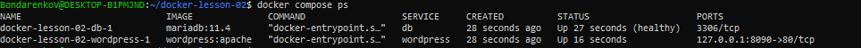
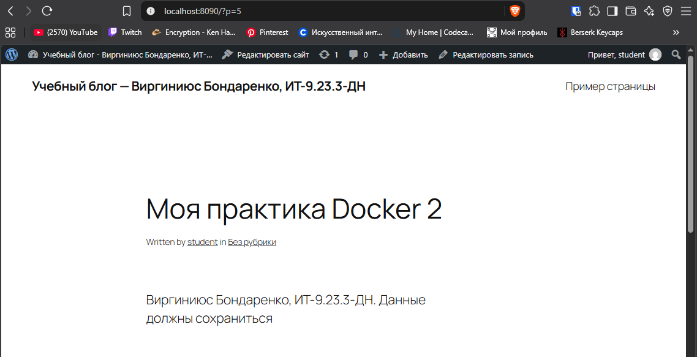
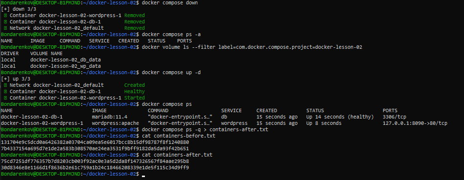
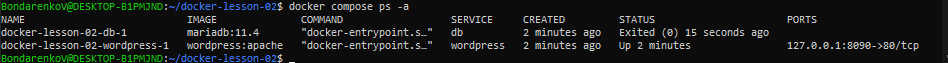
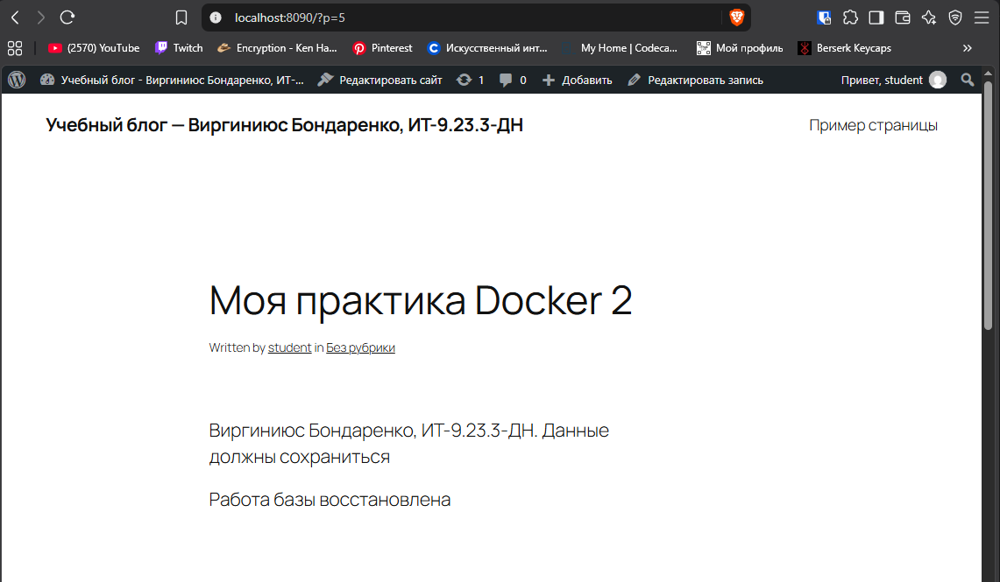

# Практика 2: Docker, WordPress и MariaDB в Compose

**Автор:** Виргиниюс Бондаренко, группа ИТ-9.23.3-ДН

Запущены два сервиса (WordPress и MariaDB) через `docker compose up -d`. Данные хранятся в томах, поэтому запись пережила `docker compose down` и `up -d`. Остановка `db` ломает сайт, запуск `db` восстанавливает его.

