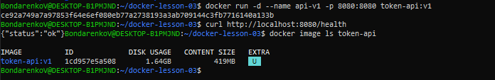
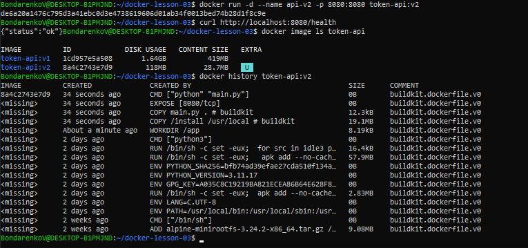
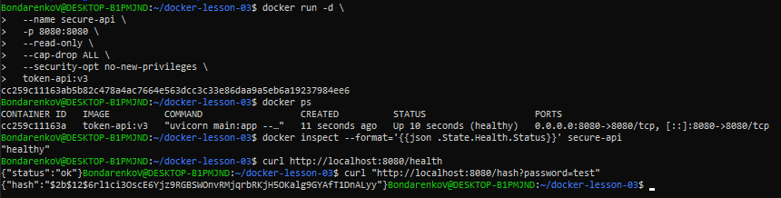
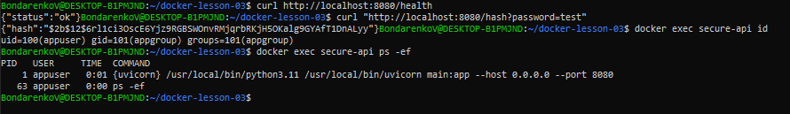

# Практика 3: Docker Production-Ready

**Автор:** Виргиниюс Бондаренко, группа ИТ-9.23.3-ДН

Микросервис на FastAPI (генерация bcrypt-хэшей), упакованный в Docker в три этапа.

## Уровень 1. Базовая упаковка
Образ `python:3.11`, кэширование слоёв (сначала `requirements.txt`, потом `main.py`), `EXPOSE 8080`, `.dockerignore`. Размер: 1.64GB.



## Уровень 2. Multi-stage
Этап `builder` с компиляторами, финальный этап на `python:3.11-alpine`. Зависимости переносятся через `COPY --from=builder`. Размер: 28.7MB, `gcc` в финальных слоях нет.



## Уровень 3. Hardening
- непривилегированный пользователь `appuser`;
- логи пишутся в `/var/log/app` (`ENV LOG_FILE` + `VOLUME`), поэтому работает `--read-only`;
- `HEALTHCHECK` с запросом к `/health` раз в 30 секунд;
- `CMD` в exec-форме, `uvicorn` получает PID 1 и сигналы SIGTERM.

```bash
docker run -d --name secure-api -p 8080:8080 --read-only --cap-drop ALL --security-opt no-new-privileges token-api:v3
```




